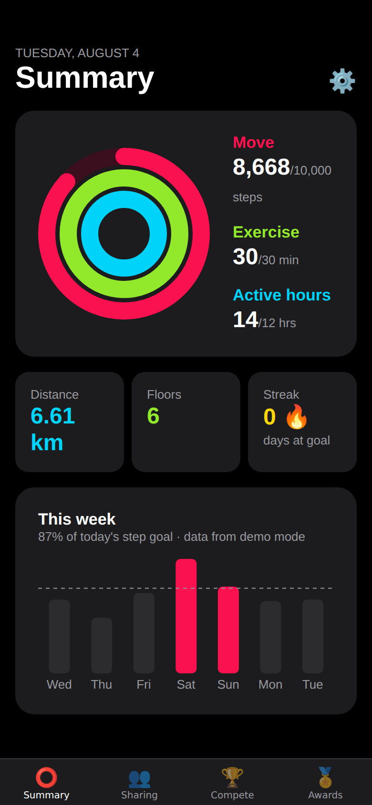
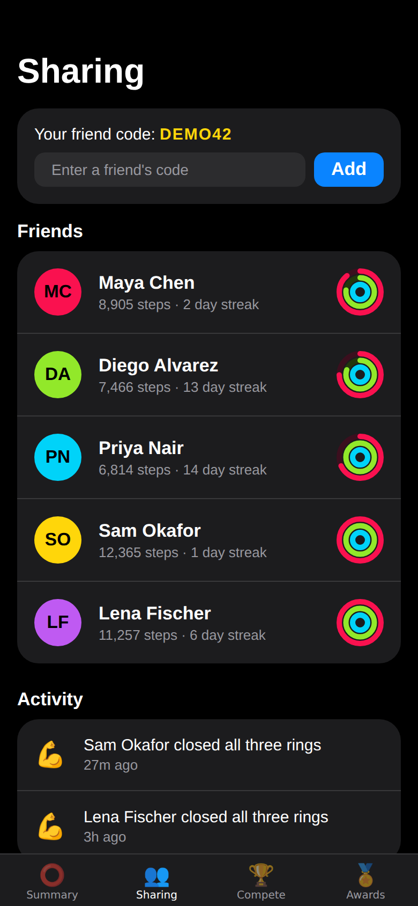
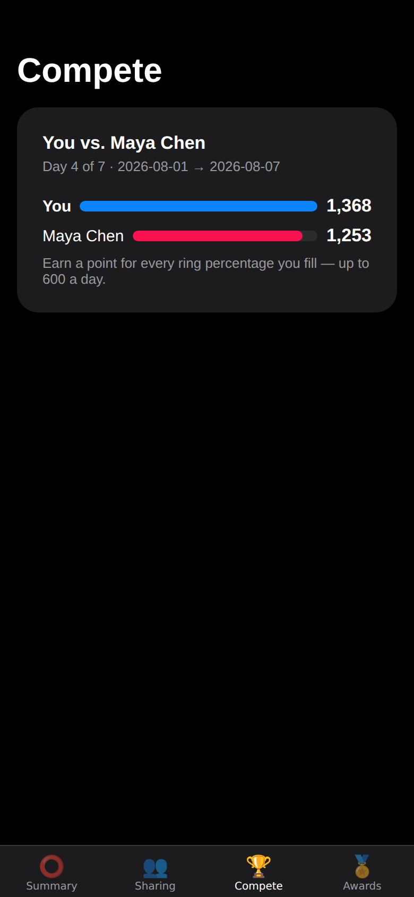
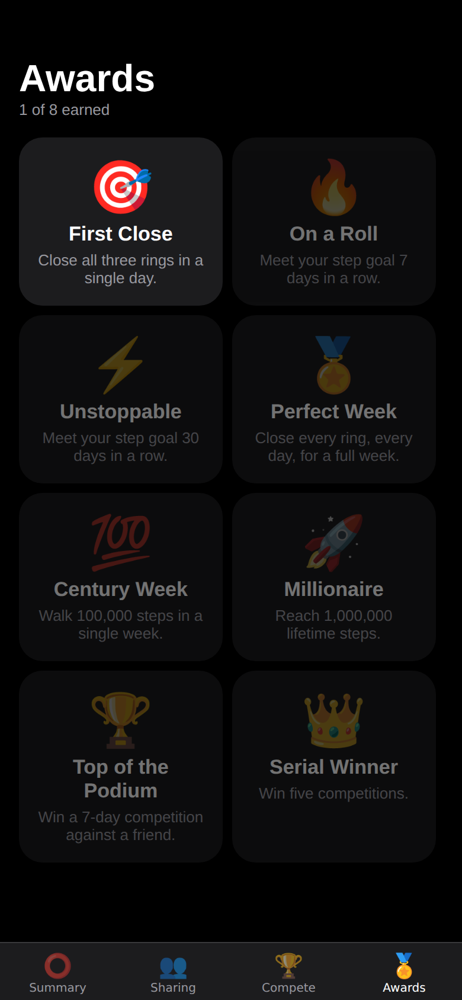

# StepCircle 👣⭕️

A social step counting app for iOS and Android, built with Expo / React
Native, borrowing the concepts that make Apple Fitness sticky:

| Summary | Sharing | Compete | Awards |
|---|---|---|---|
|  |  |  |  |

- **Activity rings** — Move (steps), Exercise (active minutes) and an
  Active-hours ring (hours with 250+ steps, the Stand-ring analog), drawn
  as the familiar concentric trio.
- **Streaks** — consecutive days at your step goal, with the current day
  counted only once it's actually met.
- **Sharing** — a friends list with live mini-rings, an activity feed
  ("Maya closed all three rings"), and one-tap cheers.
- **Competitions** — 7-day head-to-heads scored exactly like Apple Watch
  competitions: one point per ring percentage point filled, capped at 600
  a day.
- **Awards** — Perfect Week, streak medals, lifetime milestones,
  competition trophies.

## Smartwatch support

The app reads from **HealthKit** on iOS and **Health Connect** on Android.
That is also how watches deliver data: Apple Watch writes to HealthKit;
Wear OS, Galaxy Watch and Fitbit write to Health Connect. Both stores
de-duplicate phone + watch samples, so anyone wearing a watch gets
watch-quality data in the app with no extra setup. Optional native watch
companion apps (rings on the wrist) are provided as reference code in
[`watch/`](watch/README.md).

## Running it

```sh
npm install

# Fastest look around (demo data, no native health modules needed):
npx expo start --web    # in a browser, or `npx expo start` for Expo Go

# Real health data requires a dev build (native modules):
npx expo prebuild
npx expo run:ios        # or: npx expo run:android

# Device builds for TestFlight / Play internal testing (eas.json included):
npx eas build --profile preview --platform all
```

- In **Expo Go** / simulators, the health adapter falls back to
  deterministic demo data so every screen is explorable.
- In a **dev build**, iOS prompts for Health access and Android prompts via
  Health Connect (Android 14+ has it built in; earlier versions install it
  from Play).

Social features default to an on-device demo backend so everything works
with zero setup. A real multi-user backend (Firebase Auth + Firestore +
Cloud Functions with server-verified competition scoring, plus security
rules) is included: flip `SOCIAL_BACKEND` in `src/config.ts` and deploy
[`firebase/`](firebase/) — see [`docs/BACKEND.md`](docs/BACKEND.md).
Friending works by trading the 6-character friend code shown on the
Sharing tab.

## Tests

```sh
npm test        # jest — ring math, streaks, competition scoring, awards
npm run typecheck
```

## Project layout

```
src/
├── types.ts            # domain model: DailyActivity, Goals, Friend, Competition…
├── lib/                # pure logic: rings, streaks, awards, scoring (unit-tested)
├── health/             # HealthKit / Health Connect / demo adapters
├── social/             # SocialService interface + on-device demo backend
├── store/              # zustand app state
├── components/         # ActivityRings, WeekBars, StatCard, Avatar
├── screens/            # Summary, Sharing, FriendDetail, Compete, Awards, Settings
└── navigation/
firebase/               # deployable backend: rules, indexes, Cloud Functions
watch/                  # native watchOS + Wear OS companion reference apps
docs/                   # architecture + backend plan
```

See [`docs/ARCHITECTURE.md`](docs/ARCHITECTURE.md) for how the pieces fit.
